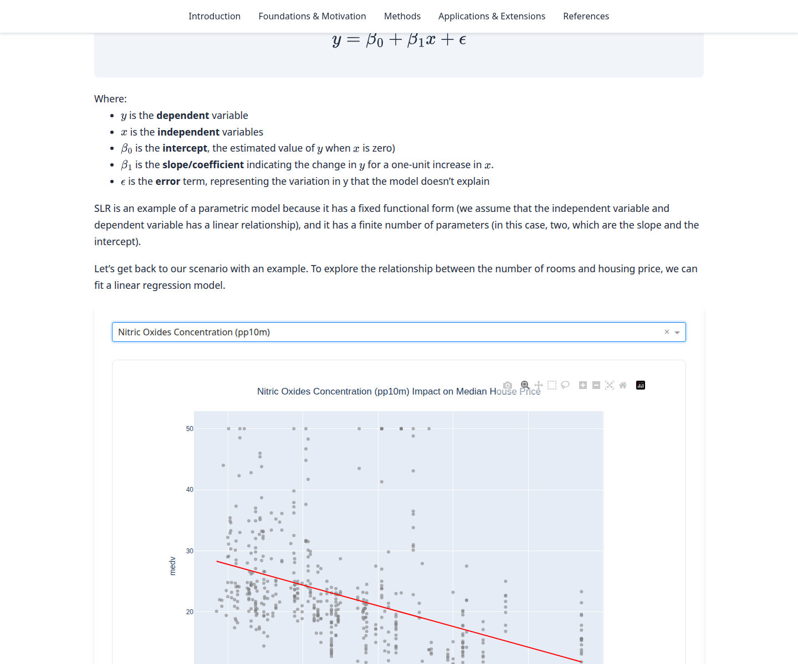

# Semiparametric Regression

Interactive [Plotly Dash](https://dash.plotly.com/) app for exploring semiparametric regression and generalized additive models (GAMs). The write-up uses Boston housing prices and the 2019 World Happiness Report.



The GitHub About text still calls this a Streamlit app. The code is Dash, and the old demo URL is a Google Cloud Run service. Update the About description from the gear icon next to **About** on the repository page to: "Interactive Plotly Dash app for exploring semiparametric regression and GAMs."

## Run locally

Python 3.13.

```bash
git clone https://github.com/Kayvan-Zahiri/Semiparametric-Regression.git
cd Semiparametric-Regression
python -m venv .venv
source .venv/bin/activate
pip install -r requirements.txt
python main.py
```

Open [http://localhost:8050](http://localhost:8050).

With conda:

```bash
conda create -n semiparametric python=3.13
conda activate semiparametric
pip install -r requirements.txt
python main.py
```

## Hosted demo

`https://linear-regression-app-302284986471.europe-west1.run.app/` currently returns Google's error page:

> The service you requested is not available yet. Please try again in 30 seconds.

HTTP status is 500 or 503. That page is Cloud Run telling you the service exists and has no ready revision. It is not a Streamlit Community Cloud app, so there is no Streamlit reboot button that will bring it back.

The container crashes while importing the app. `section3.py` reads `./data/happiness/2019.csv`, but those files were committed under `Data/happiness/`. Cloud Run is Linux, where `data` and `Data` are different directories, so startup raises `FileNotFoundError` and gunicorn never listens. On macOS those two names are the same folder, which is why the app started on the authors' machines. The image also bound gunicorn to port 8050 only. Cloud Run sends traffic to the `PORT` environment variable (8080 unless the service's container port is set to something else).

This repository now keeps every CSV under `data/`, pins `gunicorn`, `matplotlib`, and `pygam`, and starts gunicorn with `main:server` on `${PORT:-8050}`.

The public URL stays on that error page until the owner redeploys from the Google Cloud project that owns the service. The project **number** in the URL is `302284986471`. The service name is `linear-regression-app`, region `europe-west1`.

### What to click

1. Open [Cloud Run](https://console.cloud.google.com/run) and select the project whose **project number** is `302284986471`. The project picker shows the project ID; confirm the number under **IAM & Admin → Settings**, or with `gcloud projects describe PROJECT_ID --format='value(projectNumber)'`.
2. Set the region to **europe-west1** and open the service **linear-regression-app**.
3. Open **Logs** on the failing revision. The crash line is `FileNotFoundError: ./data/happiness/2019.csv`.
4. Merge this fix to `main`, then deploy a new revision:
   - **Continuous deployment already connected to this repo:** a push to the tracked branch starts a build. Open **Revisions**, wait until the new revision is healthy, and route **100%** of traffic to it if Cloud Run left traffic on the old one.
   - **No automatic deploy:** click **Edit & deploy new revision**. Point the source at this repository (Cloud Run source deploy picks up `Dockerfile`). Leave the container port at **8080**, or at **8050** if that is already set. The process listens on `$PORT`, which Cloud Run sets to the container port. Under **Authentication**, choose **Allow unauthenticated invocations**. Click **Deploy**.
5. When the revision is green, open `https://linear-regression-app-302284986471.europe-west1.run.app/` again.

From a machine already logged into that project:

```bash
gcloud run deploy linear-regression-app \
  --source . \
  --region europe-west1 \
  --port 8080 \
  --allow-unauthenticated
```
